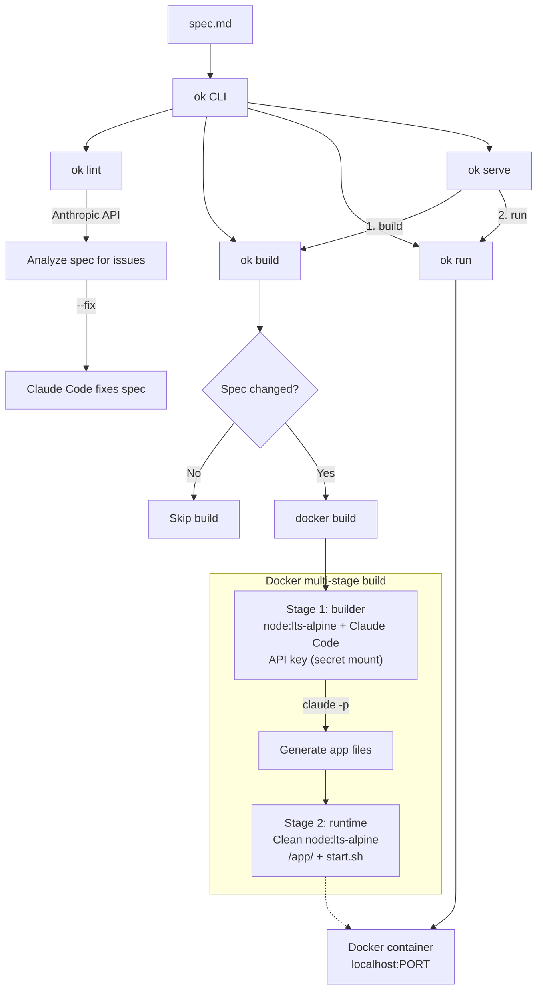

# ok

Write a spec. Get a running app.

```
ok serve spec.md
```

Software engineering is moving up an abstraction layer — from code to prose. The spec becomes the source; code becomes the build artifact.

`ok` is a CLI that turns a markdown specification into a containerized web app. Describe what you want in plain English*, and `ok` handles the rest: code generation runs inside Docker via [Claude Code](https://docs.anthropic.com/en/docs/agents-and-tools/claude-code/overview), producing a clean image with nothing but your app.

No scaffolding. No boilerplate. Just a spec and a container.

<sub>*Or any written language you prefer.</sub>

## Quick start

```bash
npm install -g okcmd
```

Set your API key:

```bash
echo "ANTHROPIC_API_KEY=sk-ant-..." > .env
```

Write a spec:

```markdown
# Counter App

A single-page app with a number displayed in large text and two buttons:
increment (+1) and decrement (-1). The count persists across page reloads
using localStorage.
```

Build and run:

```bash
ok serve counter.md
```

That's it. Open `http://localhost:3000`.

## How it works

```
spec.md → ok build → Docker image → ok run → localhost:3000
```

1. **`ok build`** stages your spec into a temporary build context and runs `docker build`
2. Inside Docker, Claude Code reads your spec and generates the entire app — source files, dependencies, startup script
3. A multi-stage build produces a clean `node:lts-alpine` runtime image (no API keys, no build tools)
4. **`ok run`** starts a container from the image with port mapping

On subsequent runs, `ok` compares your spec against the one baked into the existing image. If nothing changed, the build is skipped entirely and the app starts immediately. If the spec has changed, `ok` runs an incremental build — the existing app files are carried into the builder stage and only the necessary changes are applied, rather than regenerating everything from scratch.

## Commands

```bash
ok build <spec.md>     # Generate app and build Docker image
ok run <spec.md>       # Run a previously built image
ok serve <spec.md>     # Build + run in one step
ok stop <spec.md>      # Stop a running container
ok lint <spec.md>      # Check spec for issues before building
ok lint <spec.md> --fix # Interactively fix issues
```

Options:

```bash
ok run <spec.md> -p 8080                        # Expose on a different port
ok serve <spec.md> -e DATABASE_URL=postgres://…  # Pass env vars to the app
ok serve <spec.md> --env-file .env.app           # Pass env file to the app
```

### Linting

`ok lint` checks your spec for problems that would lead to bad or ambiguous code generation — missing details, underspecified UI/data/behavior, and contradictions.

Findings are either **errors** or **warnings**. Only contradictions (where two parts of the spec directly conflict) are errors. Everything else is a warning. If any errors are found, `ok lint` exits with code 1.

Use `--fix` to walk through each finding interactively. For each issue, you can accept the suggested fix or provide your own instructions for how to fix it. This requires [Claude Code](https://docs.anthropic.com/en/docs/claude-code) to be installed.

## Writing specs

A spec is just a markdown file that describes your app. The more detail you provide, the closer the output matches your intent. A good spec includes:

- **What the app does** — features, user interactions
- **Data model** — if it has a backend, describe the schema
- **API endpoints** — routes, request/response shapes
- **UI details** — layout, styling preferences, specific behaviors

Minimal specs work too — `ok` will make reasonable choices for anything you don't specify.

### Example: Todo app

```markdown
# Todo App

A web-based todo list.

## Features
- Add, edit, and delete todos
- Mark todos as complete
- Optional due dates with overdue highlighting
- Dark mode toggle (persisted to localStorage)

## Tech
- Backend: Express + SQLite (sql.js)
- Frontend: React served as static files
```

### What gets generated

- A complete working app under `/app/` in the container
- `start.sh` as the entrypoint
- Frontend built with Vite, served as static files
- Express backend (or just static serving if no API is needed)
- Single HTTP server on the `PORT` env var

## Requirements

- **Node.js** >= 18
- **Docker** running locally (OrbStack and other OCI-compliant runtimes work too)
- **Anthropic API key** with access to Claude Code

## Architecture



The API key is mounted as a Docker secret — it exists only during the builder stage and is never baked into the final image.

## Project structure

```
bin/ok.js          Entry point (shebang)
src/cli.js         Command definitions
src/build.js       Build orchestration, Dockerfile generation
src/run.js         Container lifecycle management
src/lint.js        Spec linter — calls Anthropic API to find issues
src/builder.mjs    Runs inside Docker — calls Claude Code to generate the app
```

## FAQ

**Why is the command called `ok`?** 

Because it's easy to type.

## License

MIT
